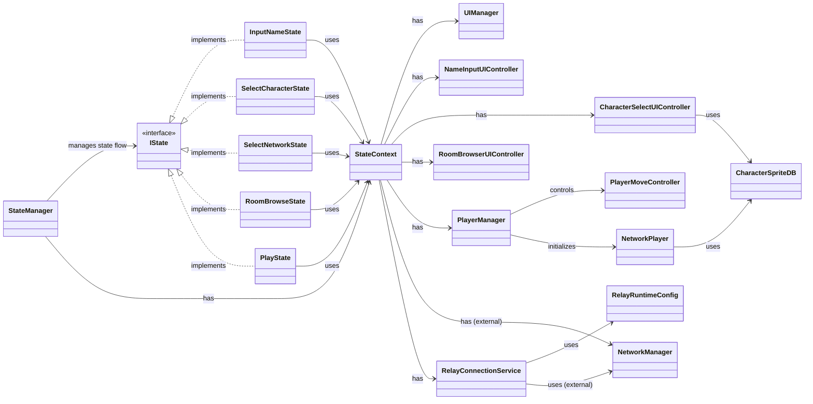

## クラス図
- 目的：現状コードに存在するクラス/インターフェースの関係を可視化する
- ルール：仕様（SPEC）と分離し、このファイルで設計詳細を管理する
- 関係の見方：
  - `implements`：インターフェース実装
  - `has`：参照を保持（コンテキストとして持つ）
  - `uses`：処理内で利用
  - `controls`：開始/制御を担当

## 関係の要点
- `StateManager` が状態遷移のオーケストレーター（全体進行役）です。
- 各 `*State` は `StateContext` 経由で必要機能にアクセスします。
- `RelayConnectionService` は Relay 接続の専用責務で、`SelectNetworkState` から呼ばれます。
- `PlayerManager` はローカル入力結果を `NetworkPlayer` 初期化と移動開始に反映します。
- `StateContext` は `UIManager` と `NameInputUIController` と `CharacterSelectUIController` と `RoomBrowserUIController` を保持します。
- `UIManager` は未移行の uGUI メニューUIと Play UI の facade です。
- `NameInputUIController` は 名前入力専用の UI Toolkit 管理を担当します。
- `CharacterSelectUIController` は キャラ選択専用の UI Toolkit 管理を担当します。
- `RoomBrowserUIController` は RoomBrowser 専用の UI Toolkit 管理を担当します。
